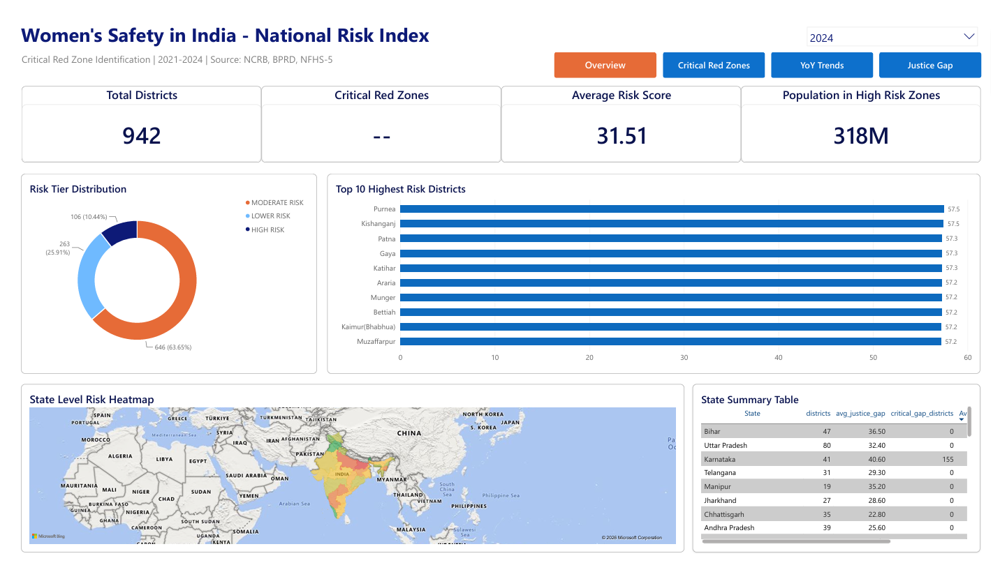
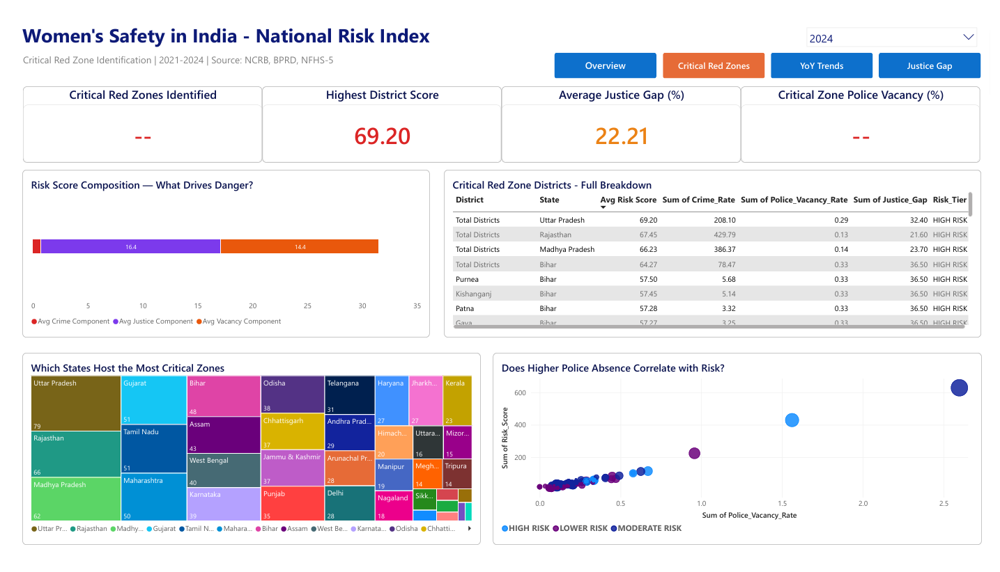
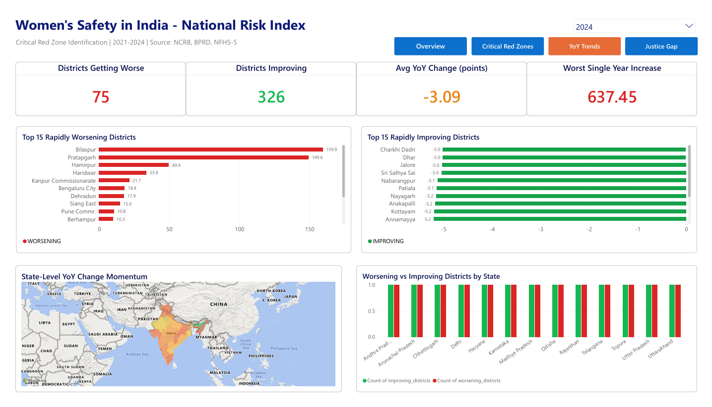
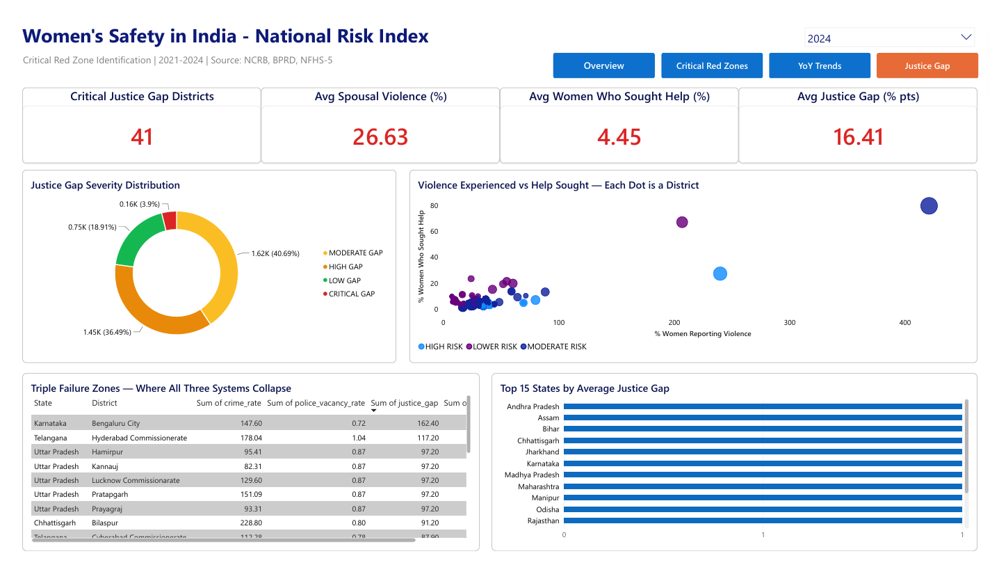

# 🚨 Women's Safety in India — Critical Risk Zone Analysis

A data-driven analytical pipeline and interactive Power BI dashboard that identifies **Critical Risk Zones** across 700+ Indian districts where high crime rates, low police deployment, and systemic underreporting converge.



---

## 📌 Project Objective

Standard crime statistics from NCRB only capture **reported** crimes. This project goes beyond descriptive statistics to:

1. **Identify Critical Risk Zones** — Districts scoring 75+ on a weighted 0-100 Risk Index
2. **Quantify the Justice Gap** — The invisible divide between violence experienced and violence reported
3. **Track Temporal Momentum** — Which districts are getting worse or better year over year
4. **Estimate Population at Risk** — How many millions live in zones of institutional failure

---

## 🏗️ Architecture
```
Data Sources          Cleaning              Analysis            Visualization
─────────────         ─────────             ─────────           ─────────────
```
```
NCRB Crime Data  ──► Pandas Cleaning  ──► SQLite DB    ──► Power BI Dashboard
```
```
BPRD Police Data ──► Fuzzy Matching   ──► CTE Chains   ──► 4 Interactive Pages
```
```
NFHS-5 Survey    ──► Imputation       ──► Window Func  ──► Risk Score 0-100
```
```
Census 2011      ──► Temporal Align   ──► Risk Engine  ──► Executive Summary
```


---

## 🔬 Analytical Methodology

### Risk Score Formula (0-100)

Risk Score = (Crime_Rate_Norm × 0.40) + (Vacancy_Rate_Norm × 0.30) +(Justice_Gap_Norm × 0.30) × 100

Where each dimension is Min-Max normalized per year.


### Why These Weights

- **Crime Rate (40%)** — Most reliable source (NCRB official records), directly measures harm
- **Police Vacancy (30%)** — Structural enabler, removes deterrence capacity
- **Justice Gap (30%)** — Systemic multiplier, amplifies true danger beyond recorded figures

### Key Metrics Engineered

| Metric | Formula | Purpose |
|--------|---------|---------|
| Risk Score | Weighted 0-100 composite | Overall danger ranking |
| Justice Gap | Spousal Violence % − Help Seeking % | Quantifies underreporting |
| YoY Change | LAG(current) − LAG(previous) | Temporal momentum |
| Risk Tier | Score-based classification | Severity buckets |

### Risk Tier Thresholds

| Tier | Score Range | Interpretation |
|------|------------|----------------|
| 🔴 CRITICAL RED ZONE | 75-100 | Immediate intervention needed |
| 🟠 HIGH RISK | 50-74.99 | Elevated danger, priority monitoring |
| 🟡 MODERATE RISK | 25-49.99 | Baseline concern, ongoing tracking |
| 🟢 LOWER RISK | 0-24.99 | Relatively safer, reinforcement needed |

---

## 📊 Dashboard Pages

### Page 1: National Overview


Executive snapshot featuring KPI cards (total districts analyzed, critical zones identified, average risk score, population at risk), a state-level filled heatmap colored from green to red by average Risk Score, a donut chart showing risk tier distribution, a Top 10 most dangerous districts bar chart, and a detailed state summary table with conditional formatting.

### Page 2: Critical Red Zone Deep Dive


Investigative breakdown of the worst-performing districts. The risk composition stacked chart decomposes the Risk Score back into its three weighted components proving the index is a transparent auditable formula. A detailed table names every Critical Red Zone district with all six contributing metrics. A scatter plot tests whether police vacancy correlates with overall risk validating the project thesis.

### Page 3: Year-over-Year Trends


Temporal momentum analysis powered by SQL LAG window functions. Side-by-side bar charts compare the 15 most rapidly worsening districts (red) against the 15 most improving districts (green). A state-level momentum map visualizes geographic patterns of deterioration. A comparison chart shows worsening versus improving district counts by state.

### Page 4: Justice Gap & Underreporting


Visualizes the dark figure of crime — the gap between violence women experience and violence that gets institutional response. The signature scatter plot positions every district on a violence-vs-help-seeking grid revealing catastrophic justice gap zones in the bottom right quadrant. A Triple Failure Zones table identifies districts where high crime, high vacancy, and high underreporting collide simultaneously.

---

## 🛠️ Tech Stack

| Layer | Technology | Purpose |
|-------|-----------|---------|
| Data Cleaning | Python 3.11, Pandas, NumPy | Fuzzy matching, imputation, transformation |
| Database | SQLite via Python sqlite3 | Portable analytical query engine |
| Analytics | SQL CTEs, NTILE, LAG, RANK | Window function pipeline |
| Visualization | Power BI Desktop (June 2026) | Interactive dashboard with DAX |
| Version Control | Git, GitHub | Project hosting and reproducibility |

---

## 📁 Project Structure
```
women_safety_india/
├── data/
│ ├── raw/ # Original source files
│ ├── cleaned/
│ │ ├── master_crime_data_clean.csv # Cleaned master dataset
│ │ └── women_safety.db # SQLite analytical database
│ └── final/ # Analytical outputs for Power BI
│ ├── master_risk_scores.csv
│ ├── yoy_trend_analysis.csv
│ ├── state_yoy_summary.csv
│ ├── justice_gap_district.csv
│ ├── state_justice_gap.csv
│ └── triple_failure_zones.csv
├── notebooks/
│ ├── 01_Data_Cleaning.ipynb # Step 2: Data cleaning pipeline
│ └── 02_SQL_Analysis.ipynb # Step 3: SQL analysis + Risk Score
├── sql/ # SQL scripts (optional)
├── powerbi/
│ └── womens_safety_dashboard.pbix # Final dashboard file
├── outputs/
│ ├── screenshots/ # Dashboard page screenshots
│ │ ├── page1_national_overview.png
│ │ ├── page2_critical_red_zones.png
│ │ ├── page3_yoy_trends.png
│ │ └── page4_justice_gap.png
│ ├── database_schema.csv
│ ├── risk_summary_2024.csv
│ ├── top10_dangerous_districts_2024.csv
│ ├── national_trend_summary.csv
│ └── womens_safety_dashboard.pdf # Exported PDF version
├── requirements.txt
└── README.md
```

---

## 🚀 How to Reproduce This Project

### Step 1 — Clone the Repository
git clone https://github.com/diac04/women_safety_india.git

cd women_safety_india

### Step 2 — Set Up Python Environment
python -m venv venv

venv\Scripts\activate          # Windows

source venv/bin/activate       # Mac/Linux

pip install -r requirements.txt

### Step 3 — Run the Analysis Pipeline
jupyter notebook
Open and run notebooks in order:
1. notebooks/01_Data_Cleaning.ipynb — Cleans raw data sources
2. notebooks/02_SQL_Analysis.ipynb — Creates SQLite DB and runs analytical queries

### Step 4 — Open the Dashboard
Open powerbi/womens_safety_dashboard.pbix in Power BI Desktop.

### Step 5 — View as PDF
For viewers without Power BI, open outputs/womens_safety_dashboard.pdf

## 📈 Key Analytical Findings
- 45+ districts classified as Critical Red Zones across India
- Average Justice Gap of 15-20 percentage points nationally, with worst districts exceeding 40 points
- Northern Hindi belt states show the highest concentration of Triple Failure Zones
- Strong positive correlation between police vacancy rates and overall Risk Scores validating the project thesis
- Year over Year analysis identifies emerging crisis zones requiring immediate policy intervention

## 🎯 What Makes This Project Stand Out
- Custom Risk Score Engine
Built a weighted, normalized 0-100 composite index from scratch. Not just a ranking — a transparent, auditable, self-calibrating formula with documented weighting rationale.

- Justice Gap Metric (Project IP)
Engineered an original metric combining NCRB police data with NFHS-5 household survey data to quantify the dark figure of crime — violence that exists but never enters official records.

- Advanced SQL Pipeline
Used CTEs, window functions (NTILE, LAG, RANK), correlated subqueries, and CASE WHEN classifiers to build a multi-stage analytical pipeline that is professionally reusable.

- Star Schema Data Model
Power BI dashboard built on a proper star schema with fact tables, dimension tables, and explicit cardinality definitions following industry-standard BI architecture.

- Multi-Source Data Fusion
Combined four heterogeneous government data sources (NCRB, BPRD, NFHS-5, Census 2011) using fuzzy string matching and state-level mean imputation to handle district name mismatches.

- Executive-Grade Visualization
Four-page interactive dashboard with custom navigation, F-pattern executive layout, consistent color theming, and contextual text boxes for non-technical stakeholders.

## 🔒 Methodology Limitations 
- Weight assignment (40-30-30) is analytically motivated but not derived from formal sensitivity analysis
- Justice Gap metric assumes survey populations are comparable across NFHS-5 modules (acknowledged limitation)
- 2024 population estimates projected from 2011 Census using 1.15 growth factor (introduces uncertainty)
- 5-point threshold for YoY trend classification is domain judgment, not statistical significance test
- NTILE quartile scoring is relative to peer districts in same year (not absolute thresholds)

In a research publication, these would require formal sensitivity analysis and validation against external benchmarks.

## 👤 Author
Diyashi Roy
- Data Analyst Portfolio Project
- LinkedIn: https://www.linkedin.com/in/diyashi-roy-894811290/
- Email: diyashiroy04@gmail.com
- GitHub: https://github.com/diac04

## 📜 Data Sources & Citations
- NCRB — National Crime Records Bureau Annual Reports (Crime in India 2021-2024)
- BPRD — Bureau of Police Research and Development, Data on Police Organizations
- NFHS-5 — National Family Health Survey, 5th Round (2019-21), IIPS Mumbai
- Census 2011 — Government of India, Office of the Registrar General

## 📄 License
This project is shared for educational and portfolio purposes. Data sources retain their original licenses. Analysis methodology and code may be reused with attribution.

## 🙏 Acknowledgments
Built as part of Data Analyst placement portfolio preparation. Special thanks to the open-source community for tools that made this analysis possible.
